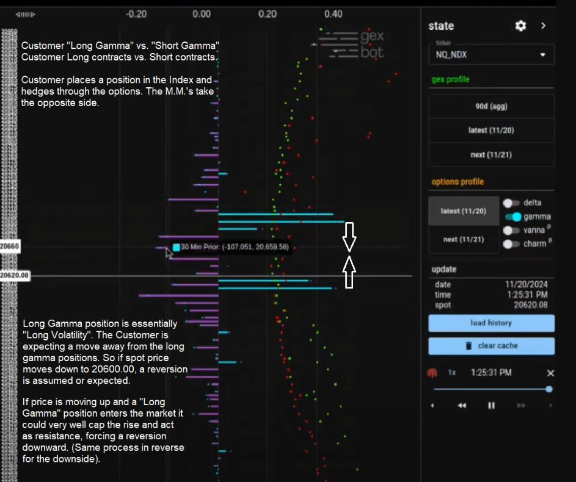

# GexBot Principals — Discord Q&A

Canonical-tier archive of Discord posts authored by **GexBot's
principals**: Jasper ("Jass") and John Kirby. When a principal answers
a question directly in Discord, the *content* carries canonical weight
even though the *medium* is community.

## Why a separate file from `community/discord_quotes.md`

- `community/discord_quotes.md` archives posts by community members
  (Freddy Sarmiento, etc.). Authority signal: practitioner experience.
  Subject to Steve's "where canonical and community disagree, canonical
  wins" rule.
- This file archives posts by GexBot staff (Jasper, John). Authority
  signal: vendor. These statements are first-party doctrine; they take
  precedence over community interpretations.

When a community member quotes a principal in a Discord post (e.g.
Freddy paraphrasing Jasper), the verbatim quote goes in
`community/discord_quotes.md`. When a principal posts directly, it
goes here.

## Source rules

- **Channel and date are mandatory.** Discord posts mutate; the
  citation must let a future reader find the original.
- **Speaker role tag preserved.** Discord usually labels principals
  with role icons (`@jass`, `@johnkirby`). Capture verbatim.
- **Quote verbatim.** Don't paraphrase; commentary goes below the
  quote.
- **Q&A format preserved.** When the post is a reply to a community
  question, the question is included for context (with the asker's
  handle), but the canonical content is the principal's answer.

---

## 2025-XX-XX — Jasper, on GEX vs gamma ladder disambiguation

**Channel:** GexBot Discord (channel not captured in source paste; likely #theory-questions based on subject matter)
**Date:** not captured in source paste (Steve to confirm)
**Speakers:** Freddy Sarmiento `[PP]` (question) → Jasper "Jass" + John Kirby tagged (Jasper answered)

### Q (Freddy Sarmiento)

> Good mng. @jass , @johnkirby — I've been reviewing the GexBot docs and looking back at previous trading sessions, and I came across something that I'm having trouble fully understanding.
>
> I noticed the 21,835 long call in the options profile, which is graphically displayed in the GEX profile with an excess of green gamma (which makes sense to me). However, right above it, there are two short calls — which should have negative gamma — but in the GEX profile, they're still showing up as green. ??
>
> I was expecting to see some excess of red gamma instead.

### A (Jasper)

> the "gex" profile is netted out calls vs puts, ignoring long/short.
> the purple/cyan ladder "gamma" is long/short contracts, ignoring call/put
>
> call/put gex → measure of directional (up/down) convexity
> long/short gamma → measure of momentum/reversion (continuation or fade)

### Disambiguation summary

This Q&A resolves a confusion latent in the vendor docs: GexBot ships
**two ladders that both visualize gamma but on orthogonal axes**.

| Ladder | Netting axis | Visualization | Operational question |
|---|---|---|---|
| **GEX profile** (green/red) | Calls vs puts (ignores long/short) | Green = call gex imbalance, Red = put gex imbalance | "What direction does the *convexity* point — up or down?" |
| **Gamma ladder** (purple/cyan) | Long vs short contracts (ignores call/put) | **Cyan = long gamma = positive convexity, Purple = short gamma = negative convexity** (per John Kirby 2025-02-21 8:04 AM, the gamma-ladder colors are an exact relabeling of the canonical "positive/negative convexity" terms in [`convexity_ladder.md`](convexity_ladder.md)) | "Will dealer hedging *amplify* moves or *fade* them?" |

The two readings answer two different questions and should not be
substituted for each other. Freddy's confusion came from reading
long/short into the GEX profile (which doesn't carry that information).
The short calls he noticed *are* visible in the GEX profile, but as
*call gex* (green) — because the GEX axis is call-vs-put, not
long-vs-short. To see the short-ness of those calls, switch to the
gamma ladder.

### Why this matters operationally

- **GEX profile reads** ([`gex_profile.md`](gex_profile.md)) → use for: identifying targets (high call gex = upside magnet, high put gex = downside magnet), defining intraday regime (call-heavy vs put-heavy day)
- **Gamma ladder reads** ([`convexity_ladder.md`](convexity_ladder.md)) → use for: predicting whether a move at a given strike will be amplified (negative customer gamma = dealer short gamma = forced-buy-into-rises = momentum/squeeze) or faded (positive customer gamma = dealer long gamma = forced-buy-into-drops = mean reversion)

A trade decision typically wants both: GEX profile to pick the *level*
(where to act), gamma ladder to predict the *behavior at that level*
(continuation vs reversion).

### Cross-references

- [`gex_profile.md`](gex_profile.md) — the call-vs-put netting axis
- [`convexity_ladder.md`](convexity_ladder.md) — the long-vs-short netting axis (and the vol-regime modulation that further conditions the behavior)
- [`metrics_math.md`](metrics_math.md) — the formulas behind both: GEX = `100 × γ × OI × spot² × 1%` per strike (sign by call/put), gamma ladder uses the same number but signed by customer-long vs customer-short

### Date follow-up

The date of this Q&A was not captured in the source paste. Steve to
confirm; once nailed down, the heading date should be updated.

---

## 2025-XX-XX — Jasper, on reading distributed negative convexity

**Channel:** GexBot Discord (channel not captured)
**Date:** not captured in source paste (Steve to confirm)
**Speakers:** unattributed asker (referencing the convexity-ladder
metrics-card text) → Jasper "Jass"

### Q

> So I read thru' metrics card for Convexity Ladder.. It says
>
> *Significant and well-distributed negative convexity: We are trading
> in liquid markets as traders are happy to sell options. (Concentrated
> negative convexity is a clear exception.)*
> *Significant and well-distributed positive convexity: Indicates an
> elevated and well-informed expectation of volatility. We typically
> see this prior to days with event-driven volatility.*
>
> Is there a visual that explains how a Significant and
> well-distributed negative convexity looks? Trying to understand when
> to worry about the purple lines and when to ignore them.

### A (Jasper)

> i think we're juts always eyeballing long gamma (cyan) for poor liq
> (possible reversion) zones, and purple is more a… after thought-ish?
>
> like for SPX, rather see it all short gamma above (liquidity
> providing) for long continuation

### What this confirms / corrects

**Color mapping (correction of the prior table).** The first Jasper Q&A
in this file just said "the purple/cyan ladder" without specifying
which color was which. I (the synthesizer) initially guessed
purple=long, cyan=short. This Q&A overrides that guess:

| Color | Side |
|---|---|
| **Cyan** | Long gamma |
| **Purple** | Short gamma |

That correction has been propagated to the disambiguation table above
and to the cross-references in `gex_profile.md` and `convexity_ladder.md`.

### Operational guidance from Jasper (his own practice)

- He leads with the **cyan (long gamma)** lane when scanning — that's where he expects "poor liquidity (possible reversion)."
- He treats the **purple (short gamma)** lane as "more an afterthought." Operationally secondary.
- For a long SPX continuation trade, his preferred setup is **short gamma above** (purple stack above spot) — described as "liquidity providing."

These are practitioner reads from a principal, not a vendor-spec rule.
Treat as how Jasper-the-trader uses the ladder, not as a definition of
what the ladder means.

### Customer-vs-dealer perspective: RESOLVED below

I initially flagged a customer-vs-dealer perspective ambiguity here.
**It's resolved by the three-Q&A exchange that follows** (entries on
2025-02-21 with Guido and the unattributed staff/Jasper closing). The
ladder is **customer perspective** throughout. Jasper's "long gamma →
reversion" is reconciled via vol-regime modulation (positive convexity
stalls in falling vol; that's what produces the reversion at cyan
levels) — not via a perspective flip.

The operational rule Jasper gave to close the question:

> We pivot at customer long gamma, but move through customer short
> gamma. That's all you really need.

See entries 3, 4, 5 below for the full exchange.

### Cross-references

- The disambiguation table at the top of this file (corrected)
- [`gex_profile.md`](gex_profile.md) observation 5 (color mapping corrected)
- [`convexity_ladder.md`](convexity_ladder.md) observation 7 (color mapping corrected)

## Revision log

- 2026-05-22: File created with Jasper's GEX-vs-gamma-ladder
  disambiguation Q&A as the first entry. Pattern: canonical-tier
  Discord archive paralleling `community/discord_quotes.md` for
  community-tier voices.
- 2026-05-22: Second Jasper Q&A added (distributed neg convexity visual
  question). Corrected the gamma-ladder color mapping (long=cyan,
  short=purple) — my earlier guess was inverted. Surfaced the
  customer-vs-dealer perspective ambiguity as unresolved.
- 2026-05-22: Three more Q&As added (entries 3, 4, 5 — Guido asking +
  GexBot staff answering + John M confirming + Jasper closing) that
  RESOLVE the customer-vs-dealer ambiguity. Convention: always think
  customer-perspective. Operational rule: pivot at cyan (customer long
  gamma), move through purple (customer short gamma). Annotated GexBot
  screenshot added to `images/customer_long_short_gamma_annotated.jpg`.
  Jasper indicated he'll ask Freddy to deprecate MM-perspective
  language; a vocabulary note has been added to community/freddy_methodology.md.
- 2026-05-22: Entry 6 added — John Kirby's 2025-02-21 8:04 AM post
  giving the gamma↔convexity equivalence. Three labels (long gamma /
  cyan / positive convexity) all refer to the same ladder positions.
  Resolves the strike-level "positive gamma" terminology in Freddy's
  paper. Top disambiguation table updated to carry the equivalence.
- 2026-05-22: Entry 7 added — Jasper 2025-03-05 2:59 PM. Two
  confirmations: (a) net convexity is more reliable for MM-reaction
  prediction than call/put alone (with "both views have value"
  caveat); (b) NET GEX IS CUSTOMER PERSPECTIVE, not MM. The
  customer-perspective convention now formally extends to the GEX
  profile, not just the convexity ladder. gex_profile.md updated to
  carry this explicitly.
- 2026-05-22: Entry 8 added — John Kirby 2025-03-27 11:01-11:05 AM
  Q&A with TommyCirj. Two takeaways: (a) Net OI correlates with gamma
  all-else-equal but gamma also depends on price/time/vol — counting
  contracts alone is inadequate; (b) GexBot's orderflow-classification
  approach is fundamentally different from naive Call OI − Put OI
  vendors. Plus TommyCirj's useful pedagogical framing: dealer-long-
  calls and dealer-long-puts differ in initial hedge setup (short vs
  long stock) but produce IDENTICAL dynamic hedging (sell on rises,
  buy on drops = stabilizing) — useful corrective to Freddy's
  mechanism inversion in OrderFlow Part 2.
- 2026-05-22: Entry 9 added — John Kirby 2025-04-04 Q&A with
  stockholm. Documents a FAILURE MODE of the pivot-at-gamma-levels
  rule: sustained directional pressure in a put-dominated regime can
  overwhelm dealer hedging. Three operational points: (a) gamma rules
  presume dealer hedging is dominant flow, not always true; (b)
  put-selling-above-spot at very high IV is often a HEDGE for short
  futures, not bullish positioning; (c) worked example — ES $5237
  puts sold at 9:50 AM, broken through by 10:15. Plus the Freddy
  channel URL is captured: youtube.com/@gextrading.
- 2026-05-22: Entry 10 added — Jasper 2025-04-09 4:30 PM Q&A with
  Andy. Compresses the regime rule into a default+exception form:
  for 0DTE, falling-vol regime is *almost always* the default, so
  the canonical pivot-at-long-gamma rule applies most days. Exception
  is pre-event sessions (CPI/FOMC/NFP) where rising vol flips long
  gamma into a breakout trigger. Plus a live trade narrative showing
  the rule getting updated mid-session ("revving long 216 tho due
  to incoming 50 minute algo"). Two follow-up flags: what is the
  50-minute algo; what is the state-degens channel.
- 2026-05-22: Entry 11 added — John Kirby 2025-04-21 8:19 AM. Large
  increase in ITM call buying = "one of my favorite signals" for
  support. Mechanism: ITM calls have high delta (0.7-1.0) so MM hedge
  size is proportionally larger than OTM, creating stronger structural
  support per contract. Distinct sub-case of the cyan-bar rule —
  ITM long gamma > OTM long gamma for support force.

---

## 2025-02-XX — Guido + GexBot staff, on Convexity Ladder color zones

**Channel:** GexBot Discord (channel not captured)
**Date:** 2025-02 (day not captured; follow-up confirms 2025-02-21)
**Speakers:** Guido (community) → GexBot staff (unattributed in the
paste — likely John based on the response style and the fact that the
later turn references "John's diagram")

### Q (Guido)

> Please clarify the terms, how would both "ZONES" look like for a
> Gexbot users point of view in terms of colors:
>
> **Point 1.** Convexity Ladder = options profile, gamma, cyan and violet
>
> The positive/right side, cyan color: Market participants classified
> as investors own long call or put, which means on the other hand,
> market makers are on the short side. Now the question is: Positive
> Gamma zones are what? I understand that you mean Cyan color. But
> this would not be the same as positive gamma itself because a long
> put has negative gamma in terms of gex profile (Red color)
>
> This leads to the 2. question, **point 2**, A. Declining volatility
> environment, market makers are Long Gamma
>
> To which part in the Convexity Ladder does this belong when you
> write "market makers are Long Gamma"? I understand you mean the
> bars with the violet color? (but they have both positive and
> negative gamma, so it is not clear for me if you describe this
> situation as Positive Gamma)
>
> For example, **point 4.**, Practical Trading Applications, Strategy 1,
> ... When in negative gamma — means the bars with violet color?

### A (GexBot staff)

> Guido, "Buying" Puts or calls creates Positive Gamma, "Selling"
> calls or puts creates negative gamma. Don't confuse the red and
> green from Gex profile with the cyan and purple of the gamma chart.
> As far as Profile Comparison open and read the 3rd attachment to
> envision the process. The negative gamma line in 3rd attachment is
> at the Point of Control, (POC), where a lot of indecisive trade
> occurs. Maybe study this type of theory before adding in the Long/
> Short Volatility part. Hope this helps.

### The attached graphic

The "3rd attachment" referenced is an annotated GexBot screenshot of
NQ_NDX from 2024-11-20, archived at
[`images/customer_long_short_gamma_annotated.jpg`](images/customer_long_short_gamma_annotated.jpg).

Vendor annotations on the graphic:

> Customer "Long Gamma" vs. "Short Gamma"
> Customer Long contracts vs. Short contracts.
>
> Customer places a position in the Index and hedges through the
> options. The M.M.'s take the opposite side.

And further down:

> Long Gamma position is essentially "Long Volatility". The Customer
> is expecting a move away from the long gamma positions. So if spot
> price moves down to 20600.00, a reversion is assumed or expected.
>
> If price is moving up and a "Long Gamma" position enters the market
> it could very well cap the rise and act as resistance, forcing a
> reversion downward. (Same process in reverse for the downside).

### What this confirms / adds

1. **Two distinct sign rules.** The GEX profile (green/red) signs by
   call-vs-put. The gamma chart (cyan/purple) signs by long-vs-short
   contracts (= positive vs negative gamma, since buying any option
   creates positive gamma).
2. **Buy = positive gamma, sell = negative gamma** — stated cleanly,
   regardless of call/put. This is the textbook truth and resolves
   Guido's confusion about long puts.
3. **NEW: negative gamma line aligns with the Point of Control (POC).**
   The volume-profile POC is where the most volume traded. Staff says
   the negative gamma line falls there because that's where indecisive
   (rangebound) trading concentrates. Worth investigating
   operationally — if confirmed across sessions, this lets us derive
   a POC estimate purely from gamma data.

---

## 2025-02-21 7:55 AM — Guido follow-up + John M confirmation

**Channel:** GexBot Discord (channel not captured)
**Date:** 2025-02-21
**Speakers:** Guido (community) → John M (= John Kirby, GexBot principal)

### Q (Guido, confirming his understanding)

> John, thank you for the examples. I understand in general, that
> calls create positive gamma exposure, means underlying has to be
> bought for a hedge. In the Gex profile Call gamma is green,
> regardless who is supposed to be on the long or short side of this
> call. In the convexity profile it is different because it is
> classified in customers, so if a customer is long, the bars are in
> cyan color, regardless if it is a long put or a long call. Right?
>
> My question above was just to clarify, which point of view is taken
> in the paper. So to understand your answer right: If there is
> written, that market makers are Long gamma, it means for us that we
> are in a low convexity zone an the price is in the area of the
> profile with violet color. Right? My questions were just about the
> terminology which is used in the paper, not about the system itself.

### A (John M)

> Yes, cyan is long gamma, (long puts or calls). Just toggle that
> gamma switch on/ off to switch back to the PUTS/ CALLS bought/ sold
> view to confirm for yourself during the day.

### What this confirms

1. **Cyan = long gamma = long puts OR long calls** (customer
   perspective, customer-bought side). Confirms Guido's reading.
2. **The customer-long classification is at the CONTRACT level** —
   if a customer is long ANY contract (call OR put), it lands in
   cyan. The call/put distinction is the GEX axis, not the gamma
   axis.
3. **NEW: UI toggle.** GexBot ships a "gamma switch" that flips the
   chart between (a) cyan/purple gamma view and (b) PUTS/CALLS
   bought/sold view. Toggling between them is John's recommended way
   to verify the mapping during a live session.

Note Guido's framing of "market makers are Long gamma → violet bars" —
he's correctly reasoning by inversion. If MM is long gamma, customer
is short gamma, customer-short shows as violet. John doesn't directly
confirm Guido's MM-inversion logic, but the next Q&A (below) does.

---

## 2025-02-XX — Closing exchange, customer-perspective convention

**Channel:** GexBot Discord (channel not captured)
**Date:** same thread as above (2025-02-21 or shortly after)
**Speakers:** Guido (community) → unattributed GexBot staff (likely
**Jasper** — "my docs" phrasing + referring to John in the third
person + the authority to deprecate Freddy's language)

### Q (Guido)

> To be precise, if "market makers are Long Gamma", means violet bars
> for us?

### A (likely Jasper)

> I'm going to ask Fredy to change this language.
>
> Yes technically violet bars would indicate MM long gamma.
>
> But there's a reason we don't think in terms of MM — everything is
> in terms of customer. That's what you'll find if you read my docs.
>
> John's diagram is correct. We pivot at customer long gamma, but
> move through customer short gamma. That's all you really need.

### What this establishes — the canonical operational rule

This is the most operationally compressed canonical statement we have
about the gamma ladder. Three things land here:

1. **Convention: customer perspective only.** "We don't think in terms
   of MM — everything is in terms of customer." If a community source
   talks about MM-long-gamma or MM-short-gamma, that's their own
   conversion; the *canonical* axis is customer.
2. **Freddy's MM-perspective vocabulary is being deprecated.** Jasper
   explicitly says "I'm going to ask Fredy to change this language."
   Freddy's videos and Discord posts use MM-perspective language
   freely; canonical convention will be customer-perspective going
   forward. A vocabulary note has been added to
   [`../community/freddy_methodology.md`](../community/freddy_methodology.md).
3. **The two-line operational rule:**

   > **Pivot at customer long gamma (cyan).**
   > **Move through customer short gamma (purple/violet).**
   > That's all you really need.

   This is the cleanest canonical statement of the gamma ladder's
   trading meaning we have. It compresses everything in
   [`convexity_ladder.md`](convexity_ladder.md) (vol-regime modulation,
   distribution shape, transition points as pivots) into a two-line
   default heuristic.

### Why this resolves the perspective ambiguity in entry 2

In the second Q&A on this page I flagged a customer-vs-dealer
perspective question as unresolved. This exchange resolves it: the
ladder is **strictly customer perspective**, and any apparent
contradiction with dealer-side intuition is bridged by vol-regime
modulation, not by switching axes.

Jasper's "long gamma (cyan) for poor liq (possible reversion) zones"
in the second Q&A is consistent with this entry's rule: customer long
gamma = pivot = price reverts at the level = poor liquidity (price
doesn't spend volume there because dealers' offsetting positions
absorb the order flow).

Jasper's "short gamma above for long continuation" (also from entry 2)
is consistent with "move through customer short gamma": for a long
trade to continue upward, you want purple bars above so price has
room to move through them.

---

## 2025-02-21 8:04 AM — John Kirby, gamma ↔ convexity equivalence

**Channel:** GexBot Discord (same thread as the entries above)
**Date:** 2025-02-21 8:04 AM (9 minutes after John's prior post)
**Speakers:** community asker (likely Guido — same thread) → John
Kirby (Moderator)

### Q (community asker)

> Thank You! It would help to mention that in the context of this
> paper a "Positive gamma zone" is the same as long gamma (which is
> cyan). Fredy wrote positive gamma, but he ment long gamma. Besides
> that, the paper is great!

### A (John Kirby)

> Call/Put gamma imbalance (green/red on gex profile)
> Long/Short gamma (cyan/purple on convexity ladder). This is the
> same as the Positive/Negative convexity I refer to in the docs.

### Why this matters — the canonical equivalence

John gives us the cleanest dual-axis canonical statement we have. Two
things land:

1. **The two-axis structure restated** (now confirmed by both
   principals — Jasper in entries 1 and 5, John here):
   - GEX profile axis = call vs put = green/red
   - Gamma ladder axis = long vs short = cyan/purple
2. **The gamma↔convexity equivalence — NEW.** John explicitly equates
   the gamma-ladder colors with the vendor docs' "positive/negative
   convexity" terms:

   | Gamma ladder color | Gamma label | Convexity label |
   |---|---|---|
   | Cyan | Long gamma | Positive convexity |
   | Purple | Short gamma | Negative convexity |

   These three labels refer to the **same thing**. The docs use
   "convexity" with sign; the UI labels use "gamma" with side; both
   resolve to the same ladder, the same colors, the same positions.

### What this resolves for Freddy's paper

The asker proposed an inline correction for Freddy's paper: "positive
gamma zone = long gamma (cyan)." John's reply confirms the
equivalence. So Freddy's "positive gamma" terminology in the paper IS
canonical — it just maps through:

> "positive gamma" (Freddy paper) = long gamma (UI) = cyan (color) = positive convexity (vendor docs)

All four phrases refer to the customer-long zones. This SHOULD have
been spelled out in the paper but wasn't. A reader who keeps the
equivalence in mind can read Freddy's paper without getting confused.

### Lingering nuance — environment vs strike-level positive gamma

Freddy's paper still uses "Positive Gamma" at two different scopes:
1. **Environment level** — "Declining vol environment: MMs are Long Gamma (Positive Gamma)" describes overall market positioning
2. **Strike level** — "positive gamma zones" describes per-strike concentration

John's equivalence resolves the strike-level usage (positive gamma at strike = long gamma at strike = cyan = positive convexity at strike). The environment-level usage is a separate issue — Freddy is using MM-talk for environment classification, which Jasper has already flagged for deprecation (entry 5).

---

## 2025-03-05 2:59 PM — Jasper, net convexity vs call/put + GEX is customer-perspective

**Channel:** GexBot Discord (channel not captured)
**Date:** 2025-03-05 (Jasper's second response is timestamped 2:59 PM)
**Speakers:** unattributed asker → Jasper "jass" (two responses)

### Q (asker)

> It seems like net convexity is a better indicator for the MM
> reaction to gex than call/put?
> The put gamma levels do not need to be always act as pivot points
> or as pinning points. But the net gamma for long and short do that
> more consistently?
>
> Also the net GEX is the market participant's net GEX view right? not MM?

### A1 (Jasper)

> yes well imo at least. there's a case for both

### A2 (Jasper, 2:59 PM — direct reply to the customer-perspective question)

> correct

### What this confirms

1. **Net convexity (long/short axis) > call/put alone for MM-reaction
   prediction.** Jasper agrees with the asker's read: aggregating to
   long/short produces more consistent pivot/pin signals than reading
   call vs put concentrations alone. *But* he caveats "there's a case
   for both" — the GEX profile carries directional convexity
   information the gamma ladder doesn't, so both views remain useful.
   The operational implication: **lead with the gamma ladder
   (cyan/purple) when looking for pivot levels; use the GEX profile
   (green/red) for directional convexity bias.**
2. **Net GEX is customer perspective, NOT MM perspective.** Jasper
   directly confirms with "correct." This extends the
   customer-perspective convention (already established for the
   convexity ladder in entry 5) to the GEX profile as well. **Both
   visualizations are customer-perspective.** Any MM-perspective read
   requires inverting the sign.

### Operational implications

- **Read order for finding pivot/pin levels:** start with the gamma
  ladder. Cyan bars are the most reliable pivot signals (per Jasper's
  agreement here + entry 5's "pivot at customer long gamma"). The GEX
  profile is the *complement*, not the primary lens, for pivot
  identification.
- **Reading the GEX profile:** sign convention is customer side. A
  green spike at a strike = customer net-long call exposure there =
  customer is positioned for upside at that strike. Red spike = the
  symmetric down-side put position.
- **Why "both views have value" matters:** John's earlier statement
  (entry 6) gave the equivalence — long gamma = positive convexity at
  strikes. Jasper is now saying that despite the equivalence at the
  per-strike level, the *aggregation* (net long/short vs net call/put)
  produces different signals across the chain. The gamma ladder's
  long/short net is the smoother indicator of where price will *react*
  ; the GEX profile's call/put net is the directional bias indicator.

### Why this matters for our measurement framework

The canonical sign convention for GEX is now nailed down. When we
compare our corpus-derived GEX readings against expected behavior, we
should anchor on:

- A positive call-gex spike → customer-long-calls concentration → bullish positioning at strike
- A negative put-gex spike → customer-long-puts concentration → bearish positioning at strike
- Customer flow drives the sign; dealer behavior is the consequence

The asker's specific claim ("put gamma levels do not always act as
pivots") is now operationally justifiable: pivots come from the
*aggregate* gamma exposure at the strike, not from the put-side
contribution alone. A strike with heavy put gex but offsetting call
gex may not pivot.

---

## 2025-03-27 11:01–11:05 AM — John Kirby, Net OI as gamma proxy + competitor approach

**Channel:** GexBot Discord (channel not captured)
**Date:** 2025-03-27 11:01 AM (first exchange) → 11:05 AM (closing)
**Speakers:** TommyCirj (community) ↔ John Kirby (Moderator)

### Q1 (TommyCirj, 11:01 AM)

> If we were to know the Net OI at a given strike, would the larger
> the volume/OI suggest larger gamma exposure?

### A1 (John Kirby, 11:01 AM)

> All else equal, yes. But gamma depends on price, time, and
> volatility. So its complicated.

### TommyCirj follow-up (11:03 AM)

> yes. I have seen a lot of companies basically look at Call OI -
> Put OI = positive/negative gamma, which then create a gex profile
> of only negative gamma essentially below and positive gamma above
> a particular midpoint
>
> where as yes long gamma means dealers are long, although they
> would be selling the underlying if they were long calls and
> buying the underlying if they were long puts
>
> what I am trying to find is a profile that depicts that flow

### A2 (John Kirby, 11:05 AM)

> yea, well you found it.

### What this establishes

#### 1. Net OI is a partial gamma proxy

John confirms volume/OI does correlate with gamma exposure
*all-else-equal*, but immediately caveats: **gamma is a function of
price, time, and volatility, not just OI**. This echoes the
`metrics_math.md` "how many" ladder:

- Open interest (gold standard, T+1 OCC tallies)
- Volume (intraday proxy, gross)
- Orderflow classification (GexBot's edge — net imbalance, not gross flow)

OI alone tells you "how many contracts." To get to gamma you also need
the Greeks at that strike — which depend on the underlying price,
time-to-expiry, and IV.

#### 2. GexBot vs the naive Call OI − Put OI approach

TommyCirj describes what *other vendors* do: compute `Call OI − Put OI`
at each strike and label the result as positive/negative gamma. This
produces a profile where everything below a midpoint is "negative
gamma" and everything above is "positive gamma." The polarity is
forced by the midpoint, not derived from positioning.

John's "yea, well you found it" implicitly endorses GexBot's approach
as the correct alternative. GexBot's orderflow-classification model
(see [`metrics_math.md`](metrics_math.md) "Orderflow Classification")
identifies *who originated the position* — the customer-long vs
customer-short distinction — instead of imposing a polarity from
strike location. The naive approach can't distinguish "long call at
strike X" from "short call at strike X" since both contribute
identically to call OI.

#### 3. Dealer-long-call vs dealer-long-put — same dynamic hedge, different initial setup

TommyCirj's framing is pedagogically useful: **dealer long gamma**
exists in two flavors that look different but behave the same:

- **Dealer long calls** → calls have positive delta → dealer initially SHORTS stock to offset → as stock rises, call delta grows → dealer sells more stock → as stock falls, dealer covers
- **Dealer long puts** → puts have negative delta → dealer initially LONGS stock to offset → as stock falls, put delta grows more negative → dealer buys more stock → as stock rises, dealer sells

Both end up with the *same* dynamic hedging pattern: **sell on rises,
buy on drops = stabilizing**. The initial hedge direction differs
(short stock vs long stock) but the response to price moves is
identical. This is why canonical
[`gamma_vanna_video.md`](gamma_vanna_video.md) §3 can correctly say
"MM long gamma → stabilizing" without specifying whether the MM is
long calls or long puts — both produce the same behavior.

This framing is also a useful corrective to the mechanism inversion in
Freddy's OrderFlow Part 2 video (see
[`../community/freddy_orderflow_series.md`](../community/freddy_orderflow_series.md)
Part 2 "Mechanism inversion" section). Freddy attributed long-gamma
hedging behavior to MM short gamma; TommyCirj articulates the correct
long-gamma behavior here and John endorses.

---

## 2025-04-04 — John Kirby on when gamma levels fail to hold

**Channel:** GexBot Discord (channel not captured)
**Date:** 2025-04-04, 11:21 AM → 12:39 PM
**Speakers:** stockholm (community) ↔ John Kirby ("John M", Moderator)

This Q&A is important because it documents a **failure mode** of the
"pivot at gamma levels" rule. The asker observes negative gamma levels
failing to stop a downside move; John explains why.

### Q1 (stockholm, 11:21 AM)

> negative gamma levels don't seem to be stopping the move. Why is that?

### A1 (John M, 12:14 PM)

> Selling Calls and Selling Puts creates Negative Gamma. It also dumps
> more liquidity into the markets pushing the market lower. We are
> also in a "Put" dominated environment.

### Q2 — stockholm's correct mechanical objection (12:19 PM)

> yes but short puts and long puts are counteracting forces from a
> delta hedging perspective.
>
> Long puts will create selling pressure where as short puts will
> create buying pressure.
>
> Im not following why the DEX from short puts is not acting as a
> stop for the falling markets

### A2 (John M, 12:24 PM)

> Until some sort of positive news flow enters the market to establish
> short covering and call buying, "Dealers" have to keep selling
> futures while they are below specific Gamma levels. Their selling
> is completely outweighing any of the options positions.
>
> Did you happen to take note of the "Put Selling" above spot price
> this morning. There were quite a few attempts where they sold Puts
> pricing 70% volatility. I would gather that these Put Sales were
> just hedges for the pounding they were doing on futures.

### A3 (John M, 12:39 PM — worked example)

> They came in and sold a few thousand of the ES $5237.00 Puts at
> 9:50 am. and by 10:15 they smashed right through them. Those key
> concepts regarding gamma are from Freddie's YouTube class.
> <https://www.youtube.com/@gextrading>

### What this establishes

#### 1. Gamma rules have limits — sustained directional pressure can overrun them

The pivot-at-gamma-levels rule (per Jasper, entry 5) and the
short-put-creates-buy-support intuition (per stockholm's mechanical
argument) both presume that **dealer hedging is the dominant flow at
the level**. In a "put dominated environment" with sustained selling,
that presumption fails: directional flow from real-money sellers can
exceed the hedging buy pressure that short-put dealers would otherwise
provide.

**stockholm's mechanical argument is correct** in normal regimes. It
just doesn't apply when the directional pressure dominates. John
doesn't dispute the mechanics — he explains why they don't bind here.

#### 2. The "put selling above spot as hedge" pattern

John identifies a specific tactical structure visible that morning:
institutions **selling puts above spot at 70% IV** as a hedge for
their primary short-futures position. The put sale isn't a bullish
bet — it's premium collection on positions they expect to expire
worthless, used to cushion the short futures.

Operational read: when you see put-selling at very high IV ABOVE spot
in a falling market, do not interpret it as bullish positioning at
the level. It's likely the cover, not the trade.

#### 3. The failed-pivot worked example

ES $5237 puts: "a few thousand" sold at 9:50 AM → "smashed right
through them" by 10:15. About 25 minutes from sale to break. Strong
short-side pressure can take out put-sale supports within minutes,
not hours.

#### 4. Freddy's channel URL captured

> Those key concepts regarding gamma are from Freddie's YouTube class.
> <https://www.youtube.com/@gextrading>

John confirms Freddy's channel is `@gextrading`. This is the source
for all the Freddy videos already in our community/ docs
(`freddy_methodology.md`, `freddy_orderflow_series.md`).

### Cross-references

- [`gex_profile.md`](gex_profile.md) observation 8 — the canonical
  basis for "lead with the gamma ladder for pivots." This Q&A
  documents *when* that rule fails.
- [`convexity_ladder.md`](convexity_ladder.md) "Risk reading vs
  direction reading" — canonical vendor text already says the
  convexity ladder is "less about discerning direction, and more
  about measuring risk." This Q&A operationalizes when that risk
  reading should NOT be inverted into a direction call.
- [`../community/freddy_methodology.md`](../community/freddy_methodology.md)
  §1 max-neg-gamma exception — this Q&A adds nuance: even the
  max-neg-gamma magnet can fail when the regime is strongly
  directional. Worth flagging in §1 as a regime caveat.

---

## 2025-04-09 4:30 PM — Jasper, regime rule of thumb (0DTE-as-default)

**Channel:** GexBot Discord (channel not captured)
**Date:** 2025-04-09, 4:26 → 4:30 PM
**Speakers:** Andy (community, new to GEX) → Jasper "jass" (Moderator)

### Q (Andy)

> ok this might be a dumb question but how can you tell if price is
> going to keep trending or breakout
>
> New to gex

### A (Jasper)

> that's a hard question lol.
>
> my rule of thumb is to look for reversion at long gamma. this is
> usually the case in falling volatility regimes (which for 0dte is
> almost always).
>
> in case of rising volatility (preceding an event) then long gamma
> for pressing a breakout
>
> i faded major long gamma here near EOD ⁠state-degens⁠ (did end up
> bailing and revving long 216 tho due to incoming 50 minute algo)

### Three confirmations land

#### 1. The default rule for 0DTE

> Reversion at long gamma. This is usually the case in falling
> volatility regimes (which for 0dte is almost always).

Jasper's parenthetical is the operationally significant claim: **for
0DTE, falling-vol regime is the default**. The polarity-flip in
[`convexity_ladder.md`](convexity_ladder.md) observation 2 lays out
both regimes; this Q&A says for 0DTE-specifically you can assume
falling-vol unless there's a specific reason not to.

The implication: the default 0DTE rule **is** the canonical pivot-at-
cyan rule (entry 5). Most days, that's the right read. Don't reach for
the rising-vol alternative without a reason.

#### 2. The exception: pre-event sessions

> In case of rising volatility (preceding an event) then long gamma
> for pressing a breakout.

Pre-event sessions (CPI, FOMC, NFP, etc.) are when vol is being bid
up. In those windows, long-gamma levels flip from **reversion zones**
to **breakout triggers** — exactly the canonical polarity flip but
stated as Jasper's operational rule.

The full default-vs-exception structure for 0DTE:

| Regime | Cyan (long gamma) | Trigger |
|---|---|---|
| Falling vol (default for 0DTE) | Pivot / reversion | Pre-set |
| Rising vol (pre-event) | Breakout press | Specific event on the calendar |

#### 3. Live trade narrative

> I faded major long gamma here near EOD ⁠state-degens⁠ (did end up
> bailing and revving long 216 tho due to incoming 50 minute algo)

Jasper is *applying* his own rule in real time. The reference to
"state-degens" is a Discord channel name where the trade was likely
called. The "50 minute algo" is a specific late-EOD algorithmic
pattern he watches for — worth following up if more context emerges
about what that algorithm does mechanically.

This is also worth noting because it shows the rule is *contingent*:
Jasper faded long gamma (his default rule), then bailed and reversed
when he detected a different signal coming (the 50-minute algo). The
rule of thumb isn't a static prediction — it's a Bayesian prior that
gets updated as new evidence arrives.

### Cross-references

- [`convexity_ladder.md`](convexity_ladder.md) observation 2 — the
  canonical polarity-flip table this Q&A operationalizes
- Entry 5 (Jasper closing exchange) — the canonical "pivot at customer
  long gamma" rule. Entry 10 adds the regime modulation conditions.
- Entry 9 (stockholm/John, prior entry) — documents the failure mode
  when sustained directional flow overrides the polarity. Two
  entries together give the regime-modulation rule + its limit.

### Follow-up flags

- **What is the "50 minute algo"?** Jasper references it as a known
  pattern. Worth catching context if it comes up again. Could be a
  rebalancing algo, a hedging algo, or a flow pattern documented
  elsewhere in Discord.
- **state-degens channel** — a Discord channel name; could be the
  trading-call channel where Jasper posts setups in real time. Useful
  to know if we ever crawl Discord systematically.

---

## 2025-04-21 8:19 AM — John Kirby on ITM call increase as support

**Channel:** GexBot Discord (channel not captured)
**Date:** 2025-04-21, 8:19 AM
**Speakers:** unattributed asker (new to GEX) → John Kirby ("John M",
Moderator)

### Q

> For those of us who are new, does such a large increase in ITM
> calls usually act as support, as it did today? Thanks

### A (John)

> YES
>
> one of my favorite signals

### What this establishes

#### The signal: large increase in ITM call buying → price support

A spike in customer buying of ITM (in-the-money) calls is one of
John's named-favorite signals for identifying price support.

#### Why it works (derived from canonical mechanism)

ITM calls have **high delta** — typically 0.7 to ~1.0, vs OTM call
deltas around 0.1 to 0.4. The delta is what determines the MM's stock
hedge size:

- Customer buys 1 ITM call (delta ~0.85) → MM is short delta -85 → MM buys ~85 shares
- Customer buys 1 OTM call (delta ~0.25) → MM buys ~25 shares

A large *increase* in ITM call buying therefore produces a
proportionally *larger* stock-buying flow from MM hedging than the
same notional in OTM calls. The MM stock buying is the structural
support — and the higher the delta, the stronger the floor.

#### Why this is a distinct subset of the cyan-bar reading

The canonical operational rule from entry 5 ("pivot at customer long
gamma") doesn't differentiate by moneyness — long gamma is long gamma
on the convexity ladder. But this Q&A says: **long gamma at ITM
strikes acts more strongly as support than long gamma at OTM
strikes**, because of the mechanical hedge-size difference.

For operational reads:
- Cyan bar at ATM/OTM strike → standard pivot candidate
- Cyan bar at ITM strike with significant size increase → John's
  "favorite signal" — elevated-conviction support

#### How to spot it on the chart

This isn't directly visible from the convexity ladder alone (which
nets long/short gamma by strike, not by moneyness vs spot). You need
either:
- The Options Profile view (which preserves call/put + strike, so ITM-
  vs-OTM is just a comparison to spot)
- The OrderFlow view (Convexity OF spikes that originate at strikes
  inside the current spot range)
- The toggle John mentioned in entry 4 (gamma view ↔ puts/calls view)
  to verify which strikes the long-gamma flow is hitting

### Cross-references

- Entry 5 (Jasper closing exchange) — the base pivot-at-long-gamma
  rule. This Q&A is a high-conviction sub-case of that rule.
- Entry 9 (stockholm/John failure mode) — describes when pivots
  *don't* hold. ITM call buying creates strong support but isn't
  immune to overwhelming directional flow.
- [`gex_profile.md`](gex_profile.md) — the Options Profile view that
  preserves moneyness information.

### Operational note

A "large increase" is the qualifier — small ITM call buying happens
all the time and doesn't trigger this signal. The pattern requires a
*notable spike* in ITM call demand to be in John's "favorite signals"
category. We don't have a quantitative threshold from John, so this
is initially a qualitative pattern recognition read.
