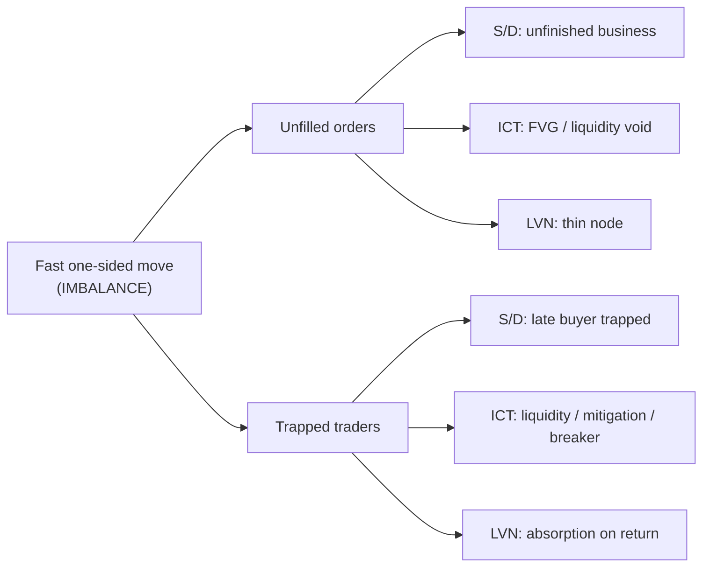

# Zone Frameworks — Deep Dive

> **Purpose:** internalize *why* supply/demand, ICT, SMC, and Carmine Rosato's Low-Volume-Node method are the **same phenomenon** in different dialects — at a level deeper than the basics. Built for Strader's 0DTE SPX work (directional singles + late-day flies).
>
> **Author:** Strader · **Date:** 2026-06-25 · **Supports bead:** st-nd5 (long single-option directional strategy)
> **Related memory:** `zone-framework-equivalence`, `carmine-rosato`, `pac-order-blocks`, `buying-movement-short-hold`, `singles-as-futures-proxy`

---

## Table of Contents

1. [The one truth underneath everything](#1-the-one-truth)
2. [Microstructure — *why* zones exist at all](#2-microstructure)
3. [Supply/Demand, formally (Seiden lineage)](#3-supply-demand-formally)
4. [ICT — the same event, split into named objects](#4-ict)
5. [SMC & LuxAlgo — the packaging](#5-smc-luxalgo)
6. [Carmine's LVN — S/D read through the volume profile](#6-carmine-lvn)
7. [The master parallel table](#7-master-parallel)
8. [Quality: what separates an A+ zone from a trap](#8-quality)
9. [Premium / Discount, inducement, liquidity sweeps](#9-premium-discount)
10. [The Strader overlay — GEX turns structure mechanical](#10-gex-overlay)
11. [Applying it to our two plays](#11-applying)
12. [Common failure modes](#12-failure-modes)
13. [Glossary / Rosetta stone](#13-glossary)

---

<a name="1-the-one-truth"></a>
## 1 — The one truth underneath everything

Every framework below is describing **one event**:

> A **fast, one-sided move** away from a price level. That speed is the fingerprint of **size** — only large, aggressive flow moves price quickly through thin liquidity. The move leaves two residues behind:
>
> 1. **Unfilled orders** — the institution couldn't complete its size before price ran. The remainder rests at the level. ("unfinished business")
> 2. **Trapped traders** — people who entered the wrong side of the move. Their stops and break-even exits become fuel.
>
> When price **returns** to the level, both residues fire → a high-probability reaction.

```
                 ┌──────────────── the event ────────────────┐
                 │  fast one-sided move  =  IMBALANCE         │
                 └───────────────┬───────────────────────────┘
                                 │
              ┌──────────────────┴───────────────────┐
              ▼                                       ▼
     UNFILLED ORDERS                          TRAPPED TRADERS
   "institutions left                     "wrong-side entrants
    resting orders"                        whose stops = fuel"
              │                                       │
     S/D: unfinished business           S/D: late buyer, odds against
     ICT: FVG / liquidity void          ICT: liquidity / mitigation / breaker
     SMC: imbalance to fill             SMC: inducement / liquidity grab
     LVN: thin node to revisit          LVN: absorption seen on the return
```

Everything else is vocabulary and precision.

---

<a name="2-microstructure"></a>
## 2 — Microstructure: *why* zones exist at all

This is the part most retail explanations skip, and it's what makes the rest click.

**The institutional fill problem.** A desk that wants to buy 10,000 SPX-equivalent units cannot show that order — if it did, price would gap away and they'd get a terrible average price. So they **accumulate quietly** at a level, feeding in size while absorbing the sellers hitting them. This sideways absorption is the **base**.

**The departure is the tell.** Eventually their buying exhausts the available sellers. With no supply left to absorb, the next aggressive buying has nothing to push against → price **explodes** out of the base. That explosive leg is **proof** a large imbalance existed there.

```
   AGGRESSIVE flow (market orders)  ──►  eats RESTING liquidity (limit orders)

   thick resting liquidity   →  price moves SLOW   →  HVN, no zone
   thin resting liquidity    →  price moves FAST   →  LVN / FVG, a zone is born
```

**Why the level holds on return.** Two reasons, both visible in order flow:
- The desk **didn't finish** — they left resting buy orders at the base. On the retest those execute (you'll see **absorption**: large limit buyers eating market sells *without* price dropping).
- The breakdown/breakout **traps** the late crowd. When price reverses, their stops trigger in your direction.

> **Key reframe:** you are not "buying support." You are **front-running the unfilled institutional orders** and **the trapped crowd's stops** that both sit at that level.

---

<a name="3-supply-demand-formally"></a>
## 3 — Supply/Demand, formally (Sam Seiden lineage)

### The four patterns

A zone is always a **base** (the quiet origin) framed by the legs around it. Two reversal patterns, two continuation patterns:

```
REVERSAL ZONES (form at a turn)        CONTINUATION ZONES (form mid-trend)

 Drop–Base–Rally  →  DEMAND             Rally–Base–Rally  →  DEMAND
    \            /                                    /
     \          /  ← strong departure              /
      \        /                            ____  /
      [ BASE ]  buy                        [BASE] buy
       └ unfilled buy orders                └ continuation of an uptrend


 Rally–Base–Drop  →  SUPPLY             Drop–Base–Drop  →  SUPPLY
      [ BASE ]  sell                      [BASE] sell ____
      /        \                                /          \
     /          \  ← strong departure         /            \
    /            \                                           \
```

| Pattern | Zone | Forms at | Bias on return |
|---|---|---|---|
| **DBR** Drop-Base-Rally | Demand | reversal (bottom) | buy |
| **RBD** Rally-Base-Drop | Supply | reversal (top) | sell |
| **RBR** Rally-Base-Rally | Demand | continuation (uptrend pullback) | buy |
| **DBD** Drop-Base-Drop | Supply | continuation (downtrend pullback) | sell |

### Where to draw the zone

```
   ┌──────────────────────────────────────────────┐
   │  proximal line = nearest edge of the base     │  ← entry trigger / first touch
   │            (closest to current price)         │
   │  ······································ base candles ·············
   │  distal line  = far edge (origin extreme)     │  ← stop goes just beyond this
   └──────────────────────────────────────────────┘
```

- **Proximal line:** the base boundary price hits *first* on return → your entry zone.
- **Distal line:** the far extreme of the base → your stop sits just beyond it. If the zone is real, price should not trade fully through the base.
- Draw from the **base**, not the departure candle. Tight bases = precise zones.

---

<a name="4-ict"></a>
## 4 — ICT: the same event, split into named objects

ICT (Inner Circle Trader / Michael Huddleston) takes the single fuzzy S/D zone and **decomposes it into separately-tradeable pieces**. That added precision is its real value.

### Order Block (OB) = a tighter version of the base

The **last opposing candle before the displacement**. Bullish OB = the last *down* candle before a strong up-move.

```
Bullish Order Block

   ▒▒▒   ← last DOWN candle before the move  =  the ORDER BLOCK
   ▒▒▒      (institutions absorbed the last selling here)
    │
            █
            █   ← displacement up (often breaks structure)
            █
            █
            │
   ... later price returns to the ▒▒▒ candle's range  →  buy the retest
```

> **OB ⊂ S/D base.** The order block is a single-candle refinement *inside* the wider S/D zone. Same idea, sniper version of the entry.

### Fair Value Gap (FVG) = the imbalance, marked on price

A 3-candle pattern where the middle candle displaces so hard that **candle 1's high and candle 3's low do not overlap**. The gap is an inefficiency the market tends to revisit to "rebalance."

```
Bullish FVG               C1 high  ▲
                                   ┊
   C1        C2        C3          ┊  ← this GAP is the FVG
   │         █         │      ──────┊──────
   █  high   █ (big    █  low       ┊
   █  ───────█  up ────█ ───────────▼  C3 low
   █         █  candle)█
   │         █         │      Rule: C1.high < C3.low  (bullish)
             █                      → no overlap = unfilled imbalance
             │                      → price often returns to fill it
```

### Liquidity = the trapped-trader fuel, made explicit

Pools of resting orders sit where everyone's stops are: **above equal highs** (buy-side liquidity) and **below equal lows** (sell-side liquidity). Smart money runs price *to* that liquidity to fill, then reverses.

```
Liquidity sweep (stop-run) above equal highs

   equal highs = a shelf of buy-stops / breakout buyers
   ─────●──────────●─────────────
                              ╱╲      (1) SWEEP above the highs:
                             ╱  ╲         grabs the liquidity (stops fire)
   ─────────────────────────    ╲
                                  ╲    (2) sharp reversal back down
                                   ╲
                                    ╲___►

   Naive S/D shorts the line  →  gets stopped by the sweep.
   ICT WAITS for the sweep, then shorts the reversal. ← the edge
```

### Mitigation block & breaker block (advanced trap mechanics)

- **Mitigation block:** price returns to an OB to let trapped traders exit at break-even, then continues — the "trapped" residue, named and timed.
- **Breaker block:** an OB that *fails*; price breaks through it and then uses it as support/resistance from the **other side**. The failure itself traps a fresh crowd.

---

<a name="5-smc-luxalgo"></a>
## 5 — SMC & LuxAlgo: the packaging

**SMC (Smart Money Concepts)** is ICT cleaned up and standardized into a teachable lexicon: **BOS** (break of structure → continuation), **CHoCH** (change of character → possible reversal), order blocks, FVG/imbalance, **internal vs external liquidity**, inducement, premium/discount. SMC explicitly *merges* S/D zones with ICT order blocks — which is exactly the bridge this doc is about.

**LuxAlgo** implements this directly:
- **Smart Money Concepts** indicator → BOS/CHoCH labels, order blocks, equal highs/lows (EQH/EQL), FVG, premium/discount zones, liquidity.
- **Price Action Concepts (PAC)** → order blocks (your primary butterfly-centering tool), structure, S/R.

> So when Carmine says his targets/stops "line up with the chart," and you read LuxAlgo order blocks — **you are both looking at the same bases/OBs**, just labeled by different tools.

---

<a name="6-carmine-lvn"></a>
## 6 — Carmine's LVN: S/D read through the volume profile

Carmine Rosato (InvestiTrade, investitrade.net) trades **departure-defined supply/demand**, but he reads the residue on the **volume profile** instead of on candles. His artifact is the **Low Volume Node**.

```
LVN formation                     VOLUME PROFILE (bar length = time/volume at price)

 price ▲
       │   ┌───────────  ████████████   HVN  ← price stalled here (heavy trade)
       │   │             ███
       │   │  FAST       █             ← LVN  ← price ripped through fast,
       │   │  MOVE ↑     █                       almost no volume = thin node
       │   │  (departure)█             ← LVN
       │   │             ███
       │   └───────────  ████████████   HVN  ← origin / base (heavy trade)
       │
       └──────────────────────────────────────────────────────────► time

  Same physics as S/D: fast move = little time at price = thin volume = the zone.
```

**His procedure (grounded from the InvestiTrade/LVN write-up):**
1. **Mark** a clear supply/demand or S/R level.
2. **Wait** for an *impulsive move away* (signals strong buyers/sellers).
3. The fast departure **leaves a low-volume node**.
4. **Wait** for price to **return** to the LVN.
5. **Confirm with order flow** — heatmap, footprint, delta, **absorption** (passive buyers vs aggressive sellers).
6. **Enter:** long off demand/support, short off supply/resistance.
7. **Stop** just past the LVN / recent swing. **Targets:** HOD/LOD, next S/D zone, another LVN, or S/R.
8. Define **$ risk first**, size by stop distance. Session: first 2–3 hrs, **out by 11:30**.

> The only thing he adds over textbook S/D is step 5 — an **order-flow confirmation gate on the retest** instead of a blind limit at the line. That gate is what keeps him from getting swept.

---

<a name="7-master-parallel"></a>
## 7 — The master parallel table

| The event | Supply/Demand (Seiden) | ICT | SMC / LuxAlgo | Carmine LVN |
|---|---|---|---|---|
| **Origin zone** | Base (DBR/RBD/RBR/DBD) | Order Block (last opposing candle) | Order block / S-D zone | Marked S/D or S-R level |
| **Fast move** | Strength of departure | Displacement | Impulse / BOS leg | Impulsive move away |
| **Gap left behind** | (implied imbalance) | Fair Value Gap (3-candle) | Imbalance / FVG | Low-Volume Node |
| **Unfilled orders** | "unfinished business" | inefficiency / liquidity void | imbalance to fill | thin node to revisit |
| **Trapped traders** | late buyer, odds against | liquidity / stop-run / mitigation / breaker | inducement / liquidity grab | absorption on the return |
| **Freshness** | odds enhancer | unmitigated OB | untested zone | first revisit |
| **Return trigger** | retest reaction | mitigation or sweep-and-reverse | OB tap | order-flow confirm (delta) |
| **Bias frame** | "the curve" (peak/valley) | premium / discount (OTE) | premium / discount | level + HOD/LOD context |
| **Trend proof** | strong leg out | BOS / MSS | BOS / CHoCH | impulsive departure |

### One event → four dialects



---

<a name="8-quality"></a>
## 8 — Quality: what separates an A+ zone from a trap

Seiden's "odds enhancers," translated into deeper reasoning:

| Enhancer | Why it works | Read |
|---|---|---|
| **Strength of departure** | bigger imbalance = more unfilled size left behind | explosive leg out, ideally a **BOS** |
| **Little time at the level** | quick base = the desk filled fast and *ran* = strong demand | thin base, few candles → shows as an **LVN** |
| **Freshness** | each touch consumes resting orders | **1st** retest best; 3rd+ usually fails |
| **Reward:Risk ≥ 1:3** | only trade if the target is ≥ 3× the stop | measure entry→next opposing zone vs entry→stop |
| **Location on "the curve"** | zones at range extremes are at exhaustion = clean; middle = chop | buy demand **low** in the range, sell supply **high** |
| **Arrival speed** | fast arrival = momentum (good for continuation); slow drift = better for reversal fade | match arrival to play type |

```
FRESHNESS DECAY

   1st touch:  ███████████   strong (most orders intact)
   2nd touch:  ██████        weaker
   3rd touch:  ██            usually fails — orders consumed
   4th+ :      ·             treat as a breakout level, not a zone
```

---

<a name="9-premium-discount"></a>
## 9 — Premium / Discount, inducement, liquidity sweeps

### Premium / Discount (ICT "OTE")

Define the **dealing range** = the recent swing low → swing high. The midpoint (50%) is **equilibrium**.

```
   swing high ───────────────────  100%  ┐
                                          │  PREMIUM  → only SELL here
                                   ── 79% │  (sell supply zones)
       OTE sweet spot (62–79%) ─►  ── 62% │
   ─────────────────────────────── 50% ── EQUILIBRIUM (avoid)
                                   ── 38% │
                                          │  DISCOUNT → only BUY here
   swing low ────────────────────  0%    ┘  (buy demand zones)
```

- **Buy** demand zones only in **discount** (below 50%). **Sell** supply only in **premium**.
- A demand zone sitting in *premium* is low quality — you'd be buying expensive. This is the rigorous version of "don't buy into resistance."

### Inducement — the trap before the trap

Smart money needs liquidity to fill. So a **minor obvious level** is left to *lure* breakout traders / early entries in — that pool is then swept to fill the real order. The **first** pullback level is often inducement; the **real OB sits just beyond it**.

```
   ...uptrend...
        ╱╲   ← inducement (minor high; traps early shorts / lures breakout buyers)
       ╱  ╲
   ───●────╲──────  ← their stops = liquidity
            ╲╱  ← sweep / grab
             │
        [ real demand OB ]  ← price reaches the TRUE zone, then goes
```

> Practical: if your entry "looks too obvious," it may be the inducement, not the zone. Expect a sweep beyond it first.

---

<a name="10-gex-overlay"></a>
## 10 — The Strader overlay: GEX turns structure mechanical

Pure price/order-flow tells you *where* unfilled orders and trapped traders sit. **GEX tells you whether dealer hedging will reinforce or steamroll that level today.** This is our edge over a pure-Carmine read.

| Regime | What it does to zones | How to trade it |
|---|---|---|
| **Positive GEX** (dealers long gamma) | suppressive / mean-revert → zones **hold**, reactions clean | **fade into** fresh zones; flies love this |
| **Negative GEX** (dealers short gamma) | trending → zones **break**, departures **extend** | favor **continuation**; let a single run *through* one zone to the next |
| **GEX magnet / wall** | a price both unfilled-order logic *and* dealer hedging point to | **highest-confluence target**; a zone at a wall is mechanically defended |

```
   CONFLUENCE STACK  (trade only when these line up)

   ┌─ fresh S/D zone (1st retest)        ── structure says "orders here"
   ├─ Low-Volume Node                    ── volume says "price travels fast to/through"
   ├─ premium/discount on the right side ── location says "good price"
   ├─ order-flow confirm (delta/absorb)  ── tape says "they're defending it now"
   └─ GEX magnet/wall agrees             ── dealer flow says "mechanically reinforced"
        ▼
      A+ SETUP
```

---

<a name="11-applying"></a>
## 11 — Applying it to our two plays

### Directional singles (the futures proxy)

Pure Carmine, expressed in a 0DTE single:
1. Fresh demand/supply or LVN identified from a strong departure.
2. Price returns; **order-flow confirms** (absorption / delta flip).
3. **Enter** the single in the reaction direction (long call off demand, long put off supply).
4. **Target** the next opposing zone / LVN / HOD-LOD; exit on arrival.
5. **Negative GEX + far from magnet** = highest "room to run" → let it travel to the magnet.

### Late-day flies (the V-dump-and-return, decoded)

Your fly setup is a **textbook demand-zone reaction** dressed as a butterfly:

```
   consolidation ───┐
                    │  (the late-day V-DUMP =
                    ▼   a liquidity sweep DOWN into a fresh demand zone / LVN)
        ════════════════════  ← DEMAND ZONE  (unfilled buy orders +
                    ╲              breakdown shorts now TRAPPED)
                     ╲___      ◄─ absorption on the tape = your trigger
                         ╲____╱
                              ╲___╱  ← RALLY-BACK = the reaction
                                   ╲___ filling orders + squeezing shorts
   the fly you bought cheap at the dump REPRICES on this rally-back ►
```

- The **V-dump** is a sweep of the prior low *into* a fresh demand zone/LVN.
- The **rally-back** is the reaction: unfilled buy orders fill **and** the breakdown shorts get squeezed.
- That reaction **is** the repricing you capture — you don't need the pin, you need the *reaction*.
- **Trigger:** order-flow absorption at the zone on the sweep (not a guess that "it's low enough").

---

<a name="12-failure-modes"></a>
## 12 — Common failure modes (how you get trapped yourself)

| Mistake | Fix |
|---|---|
| Trading a **stale** zone (3rd+ touch) | only fresh / 1st retest |
| **Blind limit** at the line, no confirmation | wait for the sweep + order-flow confirm (Carmine's step 5) |
| Buying demand in **premium** / mid-curve | only buy in discount, sell in premium |
| Entering **before** the sweep | expect a stop-run beyond the obvious level first (inducement) |
| Fighting a **negative-GEX** trend | in neg-GEX, zones break — trade continuation, not the fade |
| Ignoring **R:R < 1:3** | measure target vs stop *before* entry; skip marginal zones |
| Mistaking a **weak base** for a zone | no strong departure / no BOS = no imbalance = no zone |

---

<a name="13-glossary"></a>
## 13 — Glossary / Rosetta stone

| Term | Framework | Plain meaning |
|---|---|---|
| Base | S/D | the quiet origin where size accumulated |
| DBR / RBD / RBR / DBD | S/D | the four base patterns (demand/supply × reversal/continuation) |
| Proximal / Distal line | S/D | near edge (entry) / far edge (stop) of a zone |
| Odds enhancer | S/D | a zone-quality filter (strength, freshness, time, R:R, curve) |
| Order Block (OB) | ICT | last opposing candle before displacement (a sniper base) |
| Displacement | ICT | the strong fast leg that proves imbalance |
| Fair Value Gap (FVG) | ICT | 3-candle imbalance; C1 high ≠ C3 low |
| Liquidity (BSL/SSL) | ICT | resting stop pools above highs / below lows |
| Liquidity sweep / stop-run | ICT | price grabs the stops, then reverses |
| Mitigation block | ICT | OB price returns to, to let trapped traders exit |
| Breaker block | ICT | a failed OB that flips to S/R from the other side |
| BOS / CHoCH | SMC | break of structure (continuation) / change of character (reversal) |
| Inducement | SMC | a fake level that lures liquidity for smart money to fill on |
| Premium / Discount (OTE) | ICT/SMC | sell above equilibrium / buy below; 62–79% = sweet spot |
| Low-Volume Node (LVN) | Volume Profile / Carmine | thin band left by a fast departure = the zone |
| HVN | Volume Profile | heavy-volume band where price stalls |
| GEX magnet / wall | Strader | dealer-hedging level that mechanically reinforces a zone |

---

*Strader · Zone Frameworks Deep Dive · v1.0 · 2026-06-25 · For internal trading use. Not financial advice.*
